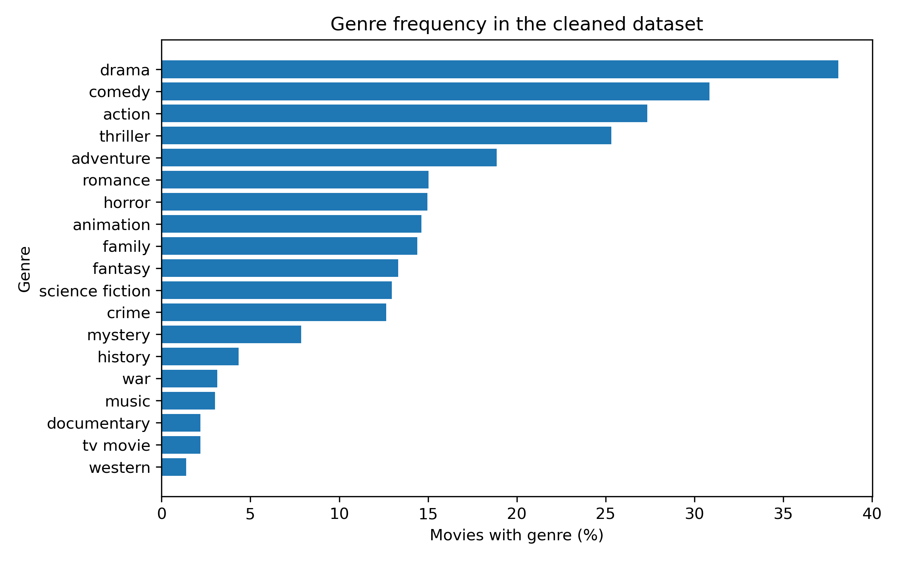
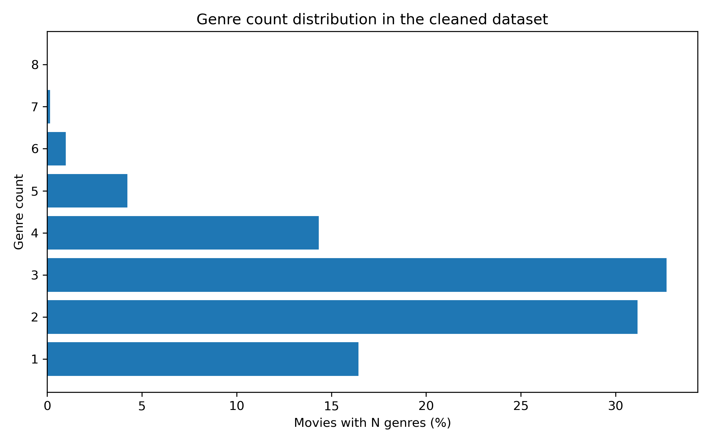
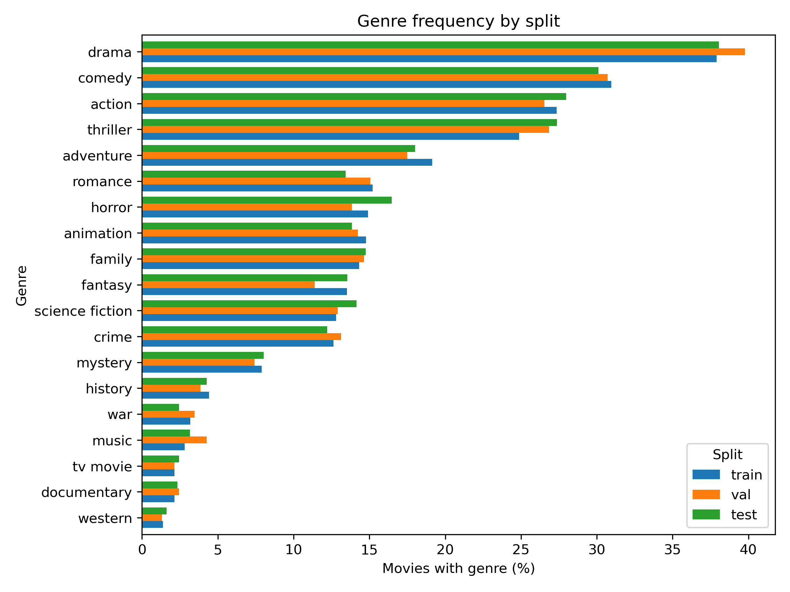
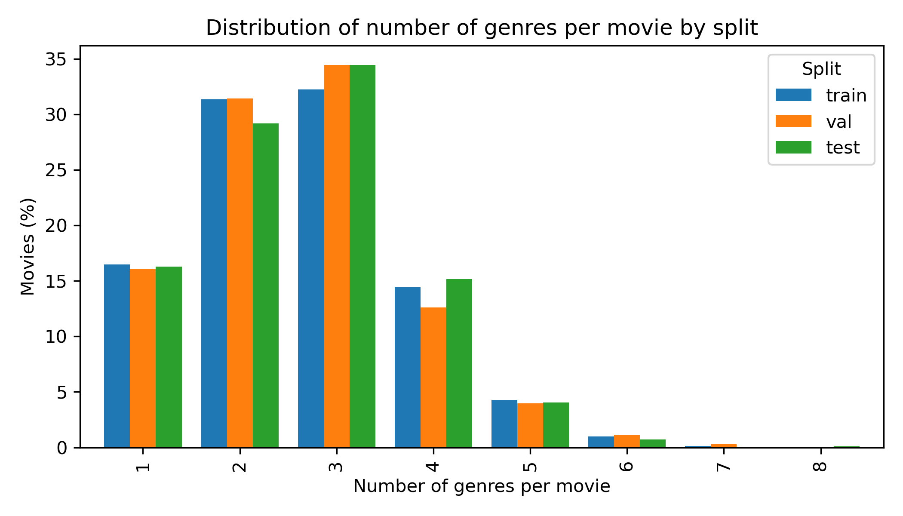
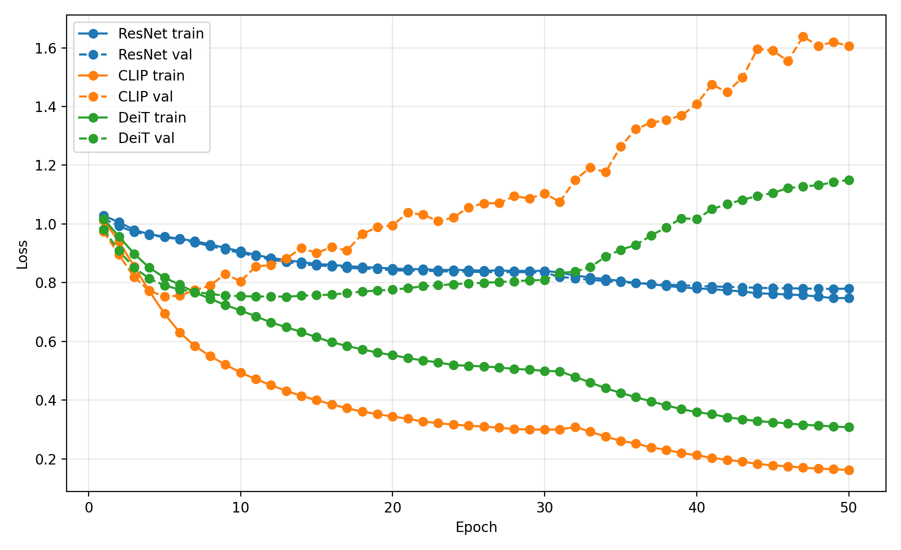
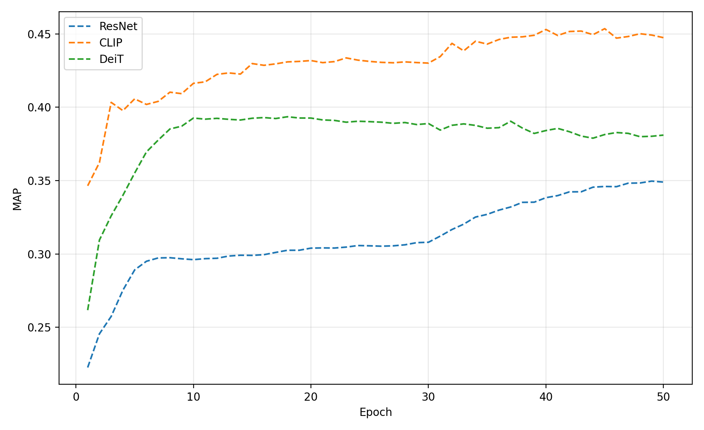
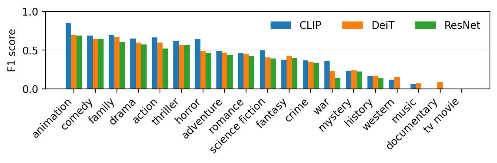

# Multi-label Film Genre Prediction from Posters

This repository contains my solution for the Hi! PARIS / B2Ideas challenge on multi-label movie genre prediction from poster images. The goal is to predict one or more genres for each movie using visual information from its poster, including composition, color, typography, and semantic cues.

The project compares several pretrained vision backbones, including ResNet, CLIP, and DeiT, fine-tuned for multi-label classification. It includes training scripts, configuration files, evaluation utilities, and visualizations used to analyze model predictions.

<p align="center">
  
</p>

<p align="center">
  <em>Predicted film genres.</em>
</p>


## Environment
Create the conda environment with

```bash
conda env create -f environment.yml
conda activate hiparis
# install the package
pip install -e .
```

## Data preparation
To download all poster images, perform the preliminary analisys of the dataset, create train/validation/test slip files run the `prepare_data.py` script
```bash
pyton scripts/prepare_data.py
```

<p align="center">
  
  
</p>

<p align="center">
  <em>Left: genre frequency distribution. Right: label count distribution.</em>
</p>

<p align="center">
  
  
</p>

<p align="center">
  <em>Left: split genre frequency distribution. Right: split label count distribution.</em>
</p>

## Training
To launch all training runs 
```bash
./run_training.sh
# or individual configuration files
python scripts/train.sh --config <config_file>
```

# Evaluation and training analysis
To run evaluation of the trained model and generate plots and result tables run
```bash
./generate_figures.sh
```

<p align="center">
  
  
</p>

<p align="center">
  <em>Left: train (solid) and validation (dashed) loss values. Right: split label count distribution.</em>
</p>

<p align="center">
  
</p>

<p align="center">
  <em>Per-genre F1 score for trained models.</em>
</p>

